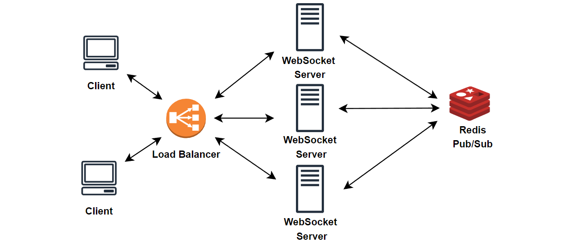

# 개요
간단한 예제를 통해 채팅 서버 구성


## websocket 
HTML5 표준 기술로, HTTP 환경에서 클라이언트와 서버 사이에 하나의 TCP 연결을 통해 실시간으로 전이중 통신을 가능하게 하는 프로토콜이다. 여기서 전이중 통신이란, 일방적인 송신 또는 수신만이 가능한 단방향 통신과 달리 가정에서의 전화와 같이 양방향으로 송신과 수신이 가능한 것을 말한다. 양방향 통신이 아닌 단방향 통신의 예로는 텔레비전 방송, 라디오를 들 수 있는데, 데이터를 수신만 할 수 있고, TV나 라디오를 통해 데이터를 보낼 수 없다.


### 통신 방식 
웹 소켓은 전이중 통신이므로, 연속적인 데이터 전송의 신뢰성을 보장하기 위해 Handshake 과정을 진행한다.
기존의 다른 TCP 기반의 프로토콜은 TCP layer에서의 Handshake를 통해 연결을 수립하는 반면, 웹 소켓은 HTTP 요청 기반으로 Handshake 과정을 거쳐 연결을 수립한다.
웹 소켓은 연결을 수립하기 위해 Upgrade 헤더와 Connection 헤더를 포함하는 HTTP 요청을 보낸다.


통상적인 상태 코드 200 대신, 웹 소켓 서버의 응답은 다음과 같다.


- 101 Switching Protocols: Handshake 요청 내용을 기반으로 다음부터 WebSocket으로 통신할 수 있다.
- Sec-WebSocket-Accept: 보안을 위한 응답 키


Handshake 과정을 통해 연결이 수립되면 응용 프로그램 계층 프로토콜이 HTTP에서 웹 소켓으로 업그레이드가 된다.
업그레이드가 되면 HTTP는 사용되지 않고, 웹 소켓 연결이 닫힐 때까지 두 끝 점에서 웹 소켓 프로토콜을 사용하여 데이터를 주고 받게 된다.

웹 소켓 연결은 주로 새로고침이나 창 닫기 등의 이벤트 발생 시 닫힌다.

### 웹 소켓 vs HTTP
웹 소켓이 HTTP 요청으로 시작되며 HTTP에서 동작하지만, 두 프로토콜은 분명히 다르게 동작한다.

웹 소켓과 HTTP의 차이점은 다음과 같다.

- HTTP는 클라이언트와 서버간 접속을 유지하지 않으며 요청과 응답 형태로 단방향 통신만 가능하다. 따라서 서버에서 클라이언트로의 요청은 불가능하다. 또한 요청-응답이 완료되면 수립했던 연결이 닫힌다. 웹 소켓은 클라이언트와 서버간 접속이 유지되며 요청과 응답 개념이 아닌 서로 데이터를 주고 받는 형식이다.
- REST한 방식의 HTTP 통신에서는 많은 URI와 Http Method를 통해 웹 어플리케이션과 상호작용하지만, 웹 소켓은 초기 연결 수립을 위한 오직 하나의 URL만 존재하며, 모든 메시지는 초기에 연결된 TCP 연결로만 통신한다.

### 간단 예제
- `TextWebsocketHandler`나 `BinaryWebSocketHandler`를 상속받아 구현
```java
public class MyHandler extends TextWebSocketHandler {
    @Override
    protected void handleTextMessage(WebSocketSession session, TextMessage message) throws Exception {
        System.out.println(message);
        System.out.println(message.getPayload());
    }

    @Override
    public void afterConnectionEstablished(WebSocketSession session) throws Exception {
        System.out.println("afterConnectionEstablished:" + session.toString());
    }

    @Override
    public void afterConnectionClosed(WebSocketSession session, CloseStatus status) throws Exception {
        super.afterConnectionClosed(session, status);
    }
}
```

- 웹 소켓 핸들러 등록
```java
@Configuration
@EnableWebSocket
public class PureWebSocketConfig implements WebSocketConfigurer {
    @Override
    public void registerWebSocketHandlers(WebSocketHandlerRegistry registry) {
        registry.addHandler(myHandler(), "/myHandler");
    }

    @Bean
    public WebSocketHandler myHandler() {
        return new MyHandler();
    }
}
```

## sockjs
SockJS는 네이티브 웹소켓을 사용하려고 하는 WebSocket 클라이언트이며, 웹소켓을 지원하지 않는 구형 브라우저에 대체 옵션을 제공한다.
우선 WebSocket 연결을 시도하고 실패할 경우 SSE, Long-Polling과 같은 HTTP 기반의 다른 기술로 전환하여 다시 연결을 시도한다.

SockJS를 사용하면 애플리케이션이 웹소켓을 사용하도록 허용하고 브라우저 등에서 웹소켓을 지원하지 않는 경우에 웹소켓을 대체할 대안 기술을 사용하도록 한다. 런타임에 사용 기술을 변경하기 때문에 애플리케이션 코드의 변경이 필요없어 유연하다는 장점이 있다.

## STOMP

STOMP (**S**imple **T**ext **O**riented **M**essaging **P**rotocol)은 메세징 전송을 효율적으로 하기 위해 탄생한 프로토콜이고, 기본적으로 pub / sub 구조로 되어있어 메세지를 전송하고 메세지를 받아 처리하는 부분이 확실히 정해져 있기 때문에 개발자 입장에서 명확하게 인지하고 개발할 수 있는 이점이 있다. 
한 줄로 정의하자면, STOMP 프로토콜은 WebSocket 위에서 동작하는 프로토콜로써 클라이언트와 서버가 전송할 메세지의 유형, 형식, 내용들을 정의하는 매커니즘이다.
또한 STOMP를 이용하면 메세지의 헤더에 값을 줄 수 있어 헤더 값을 기반으로 통신 시 인증 처리를 구현하는 것도 가능하며 STOMP 스펙에 정의한 규칙만 잘 지키면 여러 언어 및 플랫폼 간 메세지를 상호 운영할 수 있다.
STOMP는 TCP 또는 WebSocket 같은 양방향 네트워크 프로토콜 기반으로 동작한다.

이름에서 알 수 있듯, STOMP는 Text 지향 프로토콜이나, Message Payload에는 Text or Binary 데이터를 포함 할 수 있다.
위에서 언급한 pub / sub란 메세지를 공급하는 주체와 소비하는 주체를 분리해 제공하는 메세징 방법이다. 

기본적인 컨셉을 예로 들자면 우체통(Topic)이 있다면 집배원(Publisher)이 신문을 우체통에 배달하는 행위가 있고, 우체통에 신문이 배달되는 것을 기다렸다가 빼서 보는 구독자(Subscriber)의 행위가 있다. 이때 구독자는 다수가 될 수 있다. 

- 채팅방 생성 : pub / sub 구현을 위한 Topic이 생성됨
- 채팅방 입장 : Topic 구독
- 채팅방에서 메세지를 송수신 : 해당 Topic으로 메세지를 송신(pub), 메세지를 수신(sub)


### 메세지 구조

``` 
COMMAND
header1:value1
header2:value2

Body^@
```
- COMMAND : SEND, SUBSCRIBE를 지시할 수 있다.
- header : 기존의 WebSocket으로는 표현이 불가능한 header를 작성할 수 있다.
- destination : 이 헤더로 메세지를 보내거나(SEND), 구독(SUBSCRIBE)할 수 있다.

Spring framework 및 Spring Security는 STOMP 를 사용하여 WebSocket만 사용할 때보다 더 다채로운 모델링을 할 수 있다.

Messaging Protocol을 만들고 메세지 형식을 커스터마이징 할 필요가 없다.
RabbitMQ, ActiveMQ 같은 Message Broker를 이용해, Subscription(구독)을 관리하고 메세지를 브로드캐스팅할 수 있다.

WebSocket 기반으로 각 Connection(연결)마다 WebSocketHandler를 구현하는 것 보다 @Controller 된 객체를 이용해 조직적으로 관리할 수 있다.

즉, 메세지는 STOMP의 "destination" 헤더를 기반으로 @Controller 객체의 @MethodMapping 메서드로 라우팅 된다.
STOMP의 "destination" 및 Message Type을 기반으로 메세지를 보호하기 위해 Spring Security를 사용할 수 있다.

### 서비스 구조

- 서버가 down되거나 재시작을 하게되면 Message Broker(메시지 큐)에 있는 데이터들은 유실될 수 있다.
- 다수의 서버일 경우 서버간 채팅방을 공유할 수 없게 되면서 다른 서버간에 있는 사용자와의 채팅이 불가능 해진다.
- Redis는 STOMP 프로토콜을 지원하지 않지만, Redis가 제공하는 Pub/Sub 기능을 통해 메시지 브로커로 사용할 수 있다. 


### 예제

```java
@Configuration
@EnableWebSocketMessageBroker
public class WebSocketConfig implements WebSocketMessageBrokerConfigurer {

    //메세지 브로커가 지원하는 웹소켓 메시지 처리 활성화
    @Override
    public void configureMessageBroker(MessageBrokerRegistry registry) {
        //메세지 받을 경로
        // 메세지 받는곳
        registry.enableSimpleBroker("/sub");
        // 메세지 보내는 곳
        registry.setApplicationDestinationPrefixes("/pub");
    }

    //웹소켓 연결을 위한 엔드포인트 등록
    @Override
    public void registerStompEndpoints(StompEndpointRegistry registry) {
        //stomp 접속 주소
        registry.addEndpoint("/ws-stomp");
        //.withSockJS(); SocketJS 를 연결한다는 설정
    }
}
```

- `/ws-stomp`는 WebSocket 또는 SockJS Client가 웹소켓 핸드셰이크 커넥션을 생성할 경로이다.
- `/pub` 경로로 시작하는 STOMP 메세지의 "destination" 헤더는 @Controller 객체의 @MessageMapping 메서드로 라우팅된다.
- 내장된 메세지 브로커를 사용해 Client에게 Subscriptions, Broadcasting 기능을 제공한다.
- `setApplicationDestinationPrefixes` : Client에서 SEND 요청을 처리
- `enableSimpleBroker` : 해당 경로로 SimpleBroker를 등록. SimpleBroker는 해당하는 경로를 SUBSCRIBE하는 Client에게 메세지를 전달하는 간단한 작업을 수행

```java
    // MessageMapping 을 통해 webSocket 로 들어오는 메시지를 발신 처리한다.
    // 이때 클라이언트에서는 /pub/chat/message 로 요청하게 되고 이것을 controller 가 받아서 처리한다.
    // 처리가 완료되면 /sub/chat/room/roomId 로 메시지가 전송된다.
    @MessageMapping("/chat/enterUser")
    public void enterUser(@Payload ChatDTO chat, SimpMessageHeaderAccessor headerAccessor) {
        log.info(chat.toString());

        // 채팅방에 유저 추가 및 UserUUID 반환
        String userUUID = repository.addUser(chat.getRoomId(), chat.getSender());

        // 반환 결과를 socket session 에 userUUID 로 저장
        headerAccessor.getSessionAttributes().put("userUUID", userUUID);
        headerAccessor.getSessionAttributes().put("roomId", chat.getRoomId());

        chat.setMessage(chat.getSender() + " 님 입장!!");

        //메세지 저장 추가
        repository.saveMsg(chat);
        template.convertAndSend("/sub/chat/room/" + chat.getRoomId(), chat);
    }

```

@MessageMapping 을 통해 WebSocket으로 들어오는 메세지 발행을 처리한다. 
Client에서는 prefix를 붙여 `/pub/chat/message`로 발행 요청을 하면 Controller가 해당 메세지를 받아 처리하는데, 메세지가 발행되면 `/sub/chat/room/[roomId]`로 메세지가 전송되는 것을 볼 수 있다.

Client에서는 해당 주소를 SUBSCRIBE하고 있다가 메세지가 전달되면 화면에 출력한다. 

### 구동법
1. IntelliJ Run
2. `/chat/createroom` 으로 채팅방 생성 
3. localhost:8080 으로 접속
4. 2번에서 생성한 chatRoom Id 로 접속

## ref
- https://dgempiuc.medium.com/spring-websocket-and-redis-pub-sub-a02af0dabddb
- https://jhamukul007.medium.com/spring-boot-scaling-with-redis-pub-sub-788930a7632e